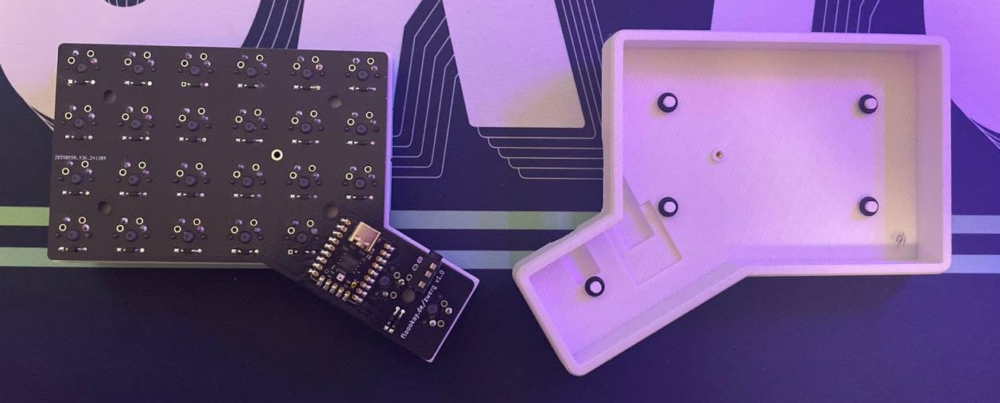

# zwerg

The zwerg is a 3x6 split ortholinear 40% keyboard (technically 4x6 but there's no numrow).
It's heavily inspired by [RGBKB.net's Sol 3](https://rgbkb.net/collections/sol-3) of which I own two and absolutely adore.

  

> [!Warning]  
> Please note that this design only works with a slim usb-c cable/connector (5.5mm).

KLE: <https://www.keyboard-layout-editor.com/#/gists/f58560b496cb75689321efaddc96187e>

The typing and tenting angle can be freely adjusted in the OpenSCAD file. I printed mine with a typing angle of 2° and tenting of 5°.

## what you need

- [ ] 2x zwerg pcbs (upload [zwerg.zip](./pcb/production/zwerg.zip) to a pcb manufacturer)
- [ ] 2x [0xCB geminis](https://keeb.supply/products/0xcb-gemini)
- [ ] 50x switches
- [ ] 50x diodes (1N4148W smd or tht)
- [ ] 2x trrs jacks
- [ ] 2x [M2x3x3 heat inserts](https://sea3d.de/10-Stueck-Gewindeeinsatz-M2-Raendelmutter-Einpressmutter-Heat-Set-Insert)
- [ ] 2x M2 5-8mm screws
- [ ] 10x 7x1.9mm o-rings
- [ ] 8x 7x1mm bumpons
- [ ] 2x 3d-printed zwerg case halves
- [ ] *optional* 2x 3d-printed zwerg plates

Building this keyboard is pretty straight forward I think. The only thing you need to look out for is that you solder all components on the same side (same goes for the mirrored pcb). Don't over tighten the screw that attaches the pcb to the case, it's supposed be screwed in lightly.

This keyboard is powered by qmk firmware, see [here](https://github.com/qmk/qmk_firmware/tree/master/keyboards/zwerg). Use the reset buttons on the Gemini for flashing the keyboard.
